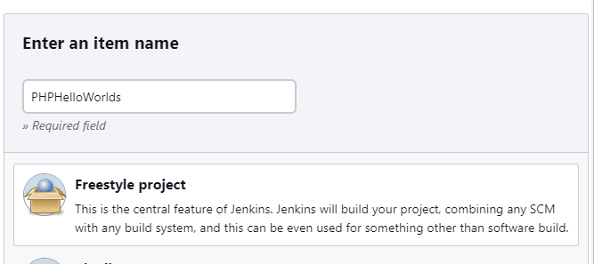
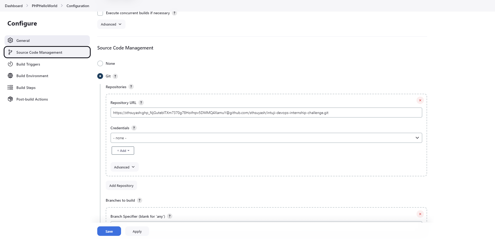
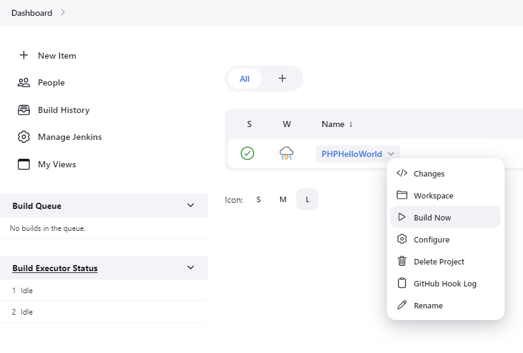
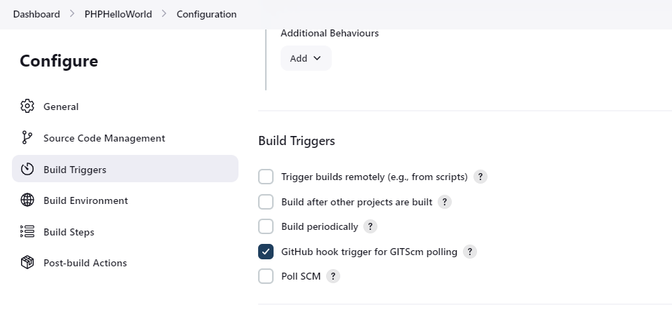

# Intuji Devops Internship Challenge

This repository contains the code and configurations for setting up a DevOps pipeline for a PHP Hello World application.

## 1. Install docker

In this task, I have written a shell script to install docker on a linux machine and saved in [install-docker.sh](install-docker.sh) file. The script is written in bash and can be run on any linux machine.

## 2. Clone the GitHub repository

In this task, I cloned the repository [cloing repo](https://github.com/silarhi/php-hello-world.git) using the command `git clone <repo>`.

### 2.1. Create a Dockerfile for building the docker image of the above application

In this step, I created a Dockerfile for building the docker image of the above application which uses nginx, which is saved in [Dockerfile](Dockerfile).

### 2.2. Push the docker image to Docker Hub

In this step, I pushed the docker image to Docker Hub using the command `docker push sthsuyash/php-hello-world:latest`.

## 3. Create a docker-compose file

In this task, I created a docker-compose file which uses the docker image created in the previous task and is saved in [docker-compose.yml](docker-compose.yml).

## 4. Install Jenkins. Install necessary plugins. Create a freestyle project for building a CI/CD pipeline for the above application which will build artifacts using a docker file directly from the GitHub repository

1. **Install Jenkins:**

   - I went to the official Jenkins website and followed the installation instructions for my operating system.

2. **Install Necessary Plugins:**

   - Once Jenkins is installed, access the Jenkins web interface through the browser at [http://localhost:8080/](http://localhost:8080/)
   - Log in to Jenkins or follow the setup wizard if required.
   - Navigate to "Manage Jenkins" > "Manage Plugins."
   - In the "Available" tab, search for and install the necessary plugins for the CI/CD pipeline. For this task, I will need plugins related to Docker and version control (e.g., Git plugin).

3. **Create a Freestyle Project:**

   - After installing the required plugins, I went back to the Jenkins dashboard.
   - Click on "New Item" to create a new Jenkins project.
   - Enter a name for the project (e.g., PHPHelloWorld).
   - Choose "Freestyle project" as the project type.
   - Click "OK" to create the project.

     

4. **Configure the Jenkins Freestyle Project:**

   - In the project configuration page, go to the "Source Code Management" section.
     - Choose Git as the version control system.
     - Enter the repository URL (e.g., [https://github.com/sthsuyash/intuji-devops-internship-challenge](https://github.com/sthsuyash/intuji-devops-internship-challenge))
   - In the "Build" section:

     - Add a build step to execute shell commands.
     - Use a command similar to the following to build the Docker image:

       ```bash
       docker build -t sthsuyash/php-hello-world:${BUILD_NUMBER} .
       ```

     - This assumes that the Dockerfile is in the root of the repository.

   - Save the project configuration.

     

5. **Triggering the CI/CD Pipeline:**

   - Go back to the Jenkins dashboard and find the newly created project.
   - Click on "Build Now" to manually trigger the build initially.
   - Jenkins will clone the GitHub repository, build the Docker image using the Dockerfile, and display the build status.

     

6. **Automate Builds (Optional):**

   - We can configure Jenkins to automatically trigger builds on each new commit to the GitHub repository. To do this, go back to the project's configuration, scroll down to the "Build Triggers" section, and select options like "GitHub hook trigger for GITScm polling."

       

This setup creates a Jenkins job, a Freestyle Project that pulls the source code from the GitHub repository, builds a Docker image using the specified Dockerfile, and executes any additional build steps that is defined. It forms the foundation for a continuous integration (CI) pipeline, allowing to automate the building and testing of the application.
